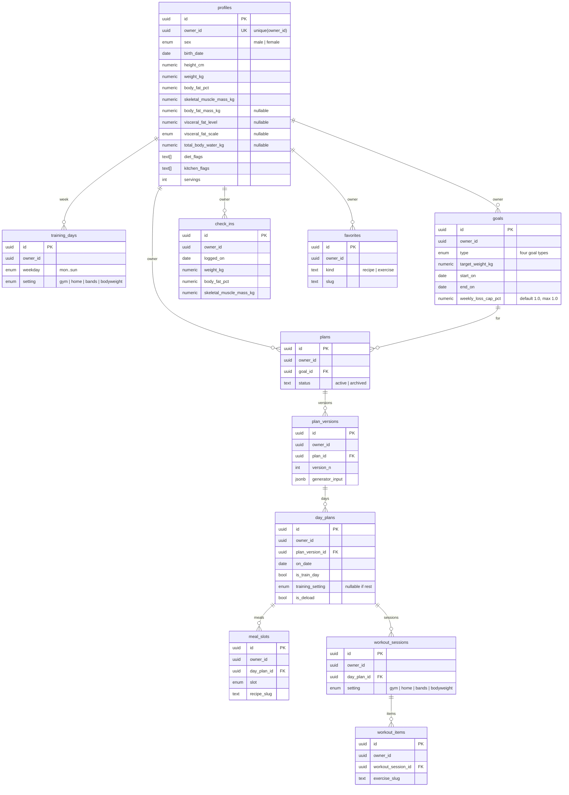

# BodyPlan ERD (auth-at-persistence, v1)

Personal rows always carry `owner_id`. Catalog is git JSON and has **no** `owner_id`. There is no singleton “the one profile in the database” table. No NextAuth `Account` / `Session` tables. No photo columns.

Source: `InitialPlan180826.md` §2.2 and §5.2 (revision 5). Engine maths: `docs/domain/engine-spec.md`. Recipe shape: `docs/domain/content-model.md`. Mixed week: `docs/decisions/0003-mixed-training-week.md`. Auth: `docs/decisions/0004-auth-at-persistence.md`. SQL proposal: `supabase/migrations/0001_init.sql` (**do not apply** without credentials).

## Owner id contract

Production `getOwnerId()` returns `session.user.id` or **throws**. `DEFAULT_OWNER_ID` is **test/fixture only**.

```ts
// src/data/owner.ts — UUID locked for fixtures; not a production write path.
export const DEFAULT_OWNER_ID =
  "198e5a49-c748-4bcc-b6ad-86445a76eb7b" as const;

export function getOwnerId(): string {
  // Phase 4: session.user.id or throw. Do not return DEFAULT_OWNER_ID in production.
  throw new Error("getOwnerId requires a signed-in session (Phase 4).");
}
```

The engine never sees an owner id. Optional `owner_id uuid references auth.users(id)` when applying SQL in a project with Auth enabled.

## Personal vs catalog

| Kind | Storage | `owner_id` |
| --- | --- | --- |
| Personal plan data | Supabase Postgres | **required** `uuid not null` |
| Catalog recipes / exercises | `data/recipes.json`, `data/exercises.json` | **absent** |

Swaps, pins, eaten flags, and favorites are personal rows (they point at catalog slugs). The catalog files are not rewritten from the public site.

## Entity relationship



Catalog boxes are omitted on purpose: they are not Postgres tables in v1.

## Table rules

Every personal table has `owner_id uuid not null`:

`profiles`, `training_days`, `goals`, `plans`, `plan_versions`, `day_plans`, `meal_slots`, `workout_sessions`, `workout_items`, `check_ins`, `favorites`.

- **`profiles`:** `unique (owner_id)` — one profile per owner, many owners possible later. Metric only: `height_cm`, `weight_kg`. Sex `male` | `female` only. **No `gym_days_per_week`.**
- **`training_days`:** unique `(owner_id, weekday)`. `setting` is `gym` | `home` | `bands` | `bodyweight`. Rest days have **no row**. App requires ≥1 train day.
- **`goals`:** `type` is one of `fat_loss`, `fat_loss_retain_muscle`, `recomp`, `maintain`. `target_weight_kg` required except `maintain`. `weekly_loss_cap_pct` defaults to `1.0` and must be `> 0` and `<= 1.0` (user may go slower via a later `end_on`, not by raising the cap).
- **`plans` / `plan_versions`:** a new version on profile or goal change; older weeks stay readable. Version row stores BMR, PAL, TDEE, energy, macros, split, cardio prescription, warnings, and the full `generator_input` snapshot (including the week map).
- **`day_plans`:** one row per calendar date in the version. `is_deload` from the engine (every 4th week). `is_train_day` and `training_setting` from the weekday map.
- **`meal_slots`:** four kinds: `breakfast`, `lunch`, `dinner`, `snack`. `recipe_slug` points at catalog JSON. `pinned`, `eaten`, `swapped_from_slug` are personal.
- **`workout_sessions` / `workout_items`:** session `setting` is that day’s training setting. Exercise slugs must be tagged for that setting. Sets live in `sets` jsonb. Cardio is a session field chosen by the generator, not an onboarding preference.
- **`check_ins`:** BodyID snapshot on a date. **No photos.** Same required + optional machine fields as `profiles`. Unique `(owner_id, logged_on)`.
- **`favorites`:** unique `(owner_id, kind, slug)`.

Diet and kitchen flags are closed slugs from `content-model.md` (`text[]` on `profiles`). `servings` is a positive integer on `profiles` (household size for the knapsack), not a tag.

## What must not appear

- NextAuth `users` / `accounts` / `sessions` / `verification_tokens`
- Photo / image URL columns
- Imperial unit columns
- `profiles.gym_days_per_week`
- Catalog tables with `owner_id`
- A `profiles` table that can only hold one row in the whole database (missing `owner_id`, or a check that `count(*) = 1`)
- An open anon policy on `DEFAULT_OWNER_ID` (`is_v1_owner`)

## RLS (see migration)

`authenticated` only: `owner_id = auth.uid()`. **Revoke** `anon` on personal tables. No v1 open policy. No Phase 4b remap.
